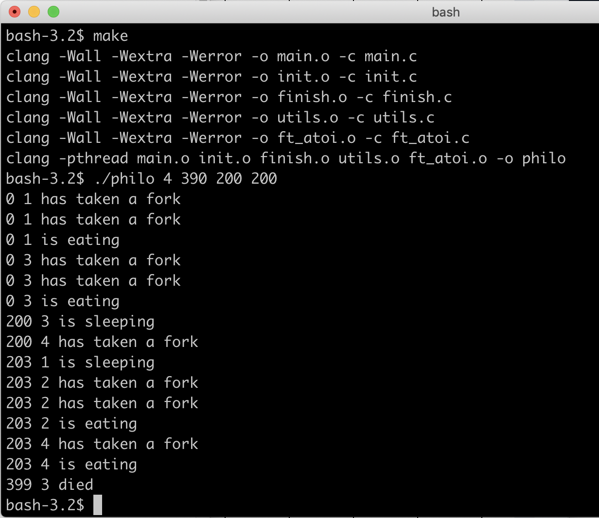
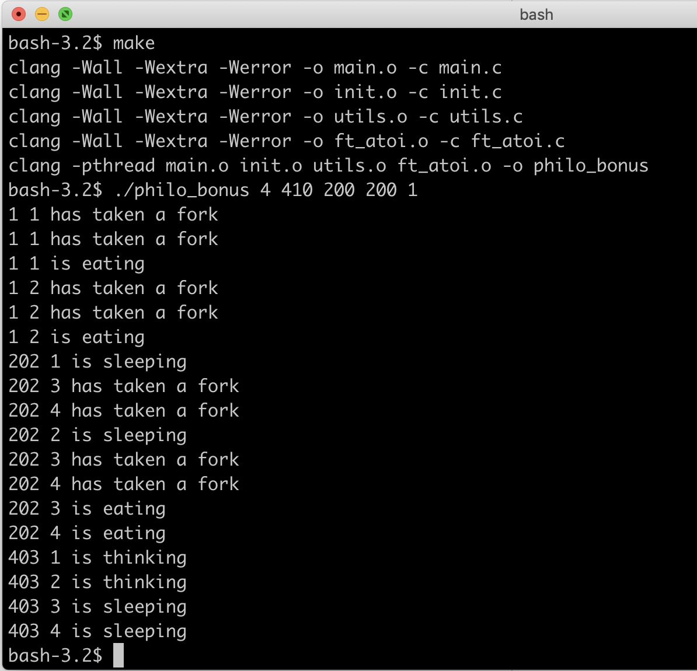

## Учебный проект в "Школе 21" - решение задачи "обедающих философов"

### Решение с помощью потоков и мьютексов (папка Philo)

Условия: 

+ Один или несколько философов сидят за круглым столом
+ В середине стола стоит большая миска со спагетти
+ Философы поочередно едят, думают и спят
+ На столе также есть вилки их столько же, сколько философов
+ Философ берет для еды правую и левую вилки, по одной в каждую руку.
+ Когда философ заканчивает есть, он кладет свои вилки обратно на стол и начинает спать. Проснувшись, они начинают думать. Симуляция прекращается, когда
философ умирает от голода либо когда все философы поели заданное количество раз
+ Каждый философ нуждается в еде и никогда не должен голодать
+ Философы не разговаривают друг с другом
+ Философы не знают, скоро ли умрет другой философ

### Решение с помощью процессов и семафора (папка Philo_bonus)

Условия:

+ Все вилки находятся в середине стола
+ Количество доступных вилок представлено семафором
+ Каждый философ должен быть отдельным процессом

Скомпилировать: `make`

Запустить - `./philo` либо `./philo_bonus` с такими аргументами: [количество философов] [время жизни без еды] [время на еду] [время на сон] [сколько раз каждый должен поесть (необязательный параметр)]
Значения в милисекундах

Например:

`./philo 4 410 200 200` - философы будут жить бесконечно

`./philo 4 390 200 200` - философ умрёт на 391 милисекунде

Программа выводит в терминал лог событий такого вида:

[Время с начала в мс] [номер философа] [действие]

